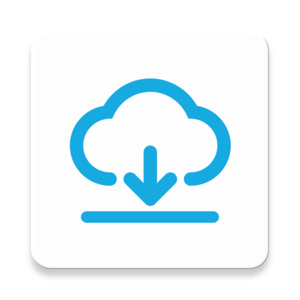

# AppUpdater



[](https://repo1.maven.org/maven2/com/github/jenly1314/AppUpdater)
[](https://jitpack.io/#jenly1314/AppUpdater)
[](https://github.com/jenly1314/AppUpdater/actions/workflows/build.yml)
[](https://raw.githubusercontent.com/jenly1314/AppUpdater/master/app/release/app-release.apk)
[](https://developer.android.com/guide/topics/manifest/uses-sdk-element#ApiLevels)
[](https://opensource.org/licenses/mit)

AppUpdater 是一个轻量级开源库，专注于实现 App 版本更新功能。它提供一键式集成方案，极大简化了 App 的升级流程，无需复杂配置，开箱即用，助你快速构建可靠的 App 更新体验。

* **AppUpdater** 核心库主要包括 **app-updater** 和 **app-dialog** 。

> **app-updater** 主要负责后台下载更新App，封装了所有下载配置细节，提供真正的一键式傻瓜升级体验。

> **app-dialog** 主要是提供常用的Dialog和DialogFragment，简化弹框提示的实现，支持灵活的布局样式定制。

* 下载更新和弹框提示之所以分开是因为这本来就是两个功能。二者完全独立，可以在解耦的同时减少侵入性。

> 如果你仅需要纯粹的App下载更新功能，单独依赖 **app-updater** 即可满足需求；

> 如果你需要在下载更新时配合对话框进行用户交互，那么 **app-updater** + **app-dialog** 的组合将是完美搭配；

> 当然，你也可以单独使用 **app-dialog**，它适用于任何需要对话框交互的场景。

## 功能介绍
- ✅ 专注于App更新一键傻瓜式升级
- ✅ 够轻量，体积小
- ✅ 支持监听下载和自定义下载流程
- ✅ 支持下载失败时，可重新下载
- ✅ 支持文件MD5校验，避免重复下载
- ✅ 支持通知栏提示内容和流程全部可配置
- ✅ 支持取消下载
- ✅ 支持使用HttpsURLConnection或OkHttpClient进行下载
- ✅ 支持Android 10(Q)
- ✅ 支持Android 11(R)
- ✅ 支持Android 12(S)

## 效果展示


> 你也可以直接下载 [演示App](https://raw.githubusercontent.com/jenly1314/AppUpdater/master/app/release/app-release.apk) 体验效果

## 引入

### Gradle:

1. 在Project的 **build.gradle** 或 **setting.gradle** 中添加远程仓库

    ```gradle
    repositories {
        //...
        mavenCentral()
    }
    ```

2. 在Module的 **build.gradle** 里面添加引入依赖项

    ```gradle

    //app-updater
    implementation 'com.github.jenly1314.AppUpdater:app-updater:2.0.0'
    //app-dialog
    implementation 'com.github.jenly1314.AppUpdater:app-dialog:2.0.0'

    ```

## 使用

### 使用说明

**app-dialog** 和 **app-updater** 的使用方式简单直观，主要针对常见场景提供了丰富的预设配置。在充分保证灵活性的同时，尽可能的简化
使用流程：你可以直接采用默认配置，也可以根据实际需求进行个性化调整，只需关注需要修改的配置即可。

### 特别说明

#### 2.x版本变化

**2.x** 在重构过程中，采用 Kotlin 对代码进行了全面升级，在保留传统链式调用的基础上，新增了对 Kotlin DSL 风格的支持。
新版本在兼容 Java 调用的同时，显著提升了 Kotlin 环境下的使用体验。整体架构延续了 **1.x** 版本的设计思路，主要针对
接口定义与配置字段进行了部分优化与调整。

> 如果你是从 **1.x** 版本升级至 **2.x** 的，请注意版本间存在一些不兼容的变更。最新使用方式参考下方的使用说明。

如果不想升级，也可以继续使用 **1.x** ；请查看 [**1.x分支**](https://github.com/jenly1314/AppUpdater/tree/1.x)

---

### 快速使用

如果没有特别需求，直接使用即可。（因为`AppUpdater`的默认配置，就是最推荐的配置。）

```Java
// 一句代码，傻瓜式更新
new AppUpdater(context, apkUrl).start();
```

```Java
// 简单对话框升级示例
AppDialogConfig appDialogConfig = new AppDialogConfig(context)
        .setTitle("发现新版本")
        .setConfirm("升级")
        .setContent("1、新增某某功能；\n2、修改某某问题；\n3、优化某某BUG。")
        .setOnClickConfirm(new View.OnClickListener() {
            @Override
            public void onClick(View v) {
                // 开始下载更新
                new AppUpdater(context, apkUrl).start();
                AppDialog.dismissDialog();
            }
        });

// 显示对话框
AppDialog.showDialog(appDialogConfig);
```

> 以上便是基本的核心用法，简单易上手。如需了解更多个性化配置，请继续阅读下方更详细的说明。

### **app-dialog** 使用说明

**app-dialog** 是一个通用的 Dialog 和 DialogFragment 组件库，支持任意样式和交互的个性化实现，帮助开发者快速构建灵活的提示对话框。

以下是传统链式调用与 Kotlin DSL 调用的对比示例：

#### 传统链式调用方式 （Java 或 Kotlin）

```java
// 对话框常规使用示例
AppDialogConfig appDialogConfig = new AppDialogConfig(context)
    .setTitle("标题")
    .setContent("对话框内容")
    .setConfirm("确定")
    .setOnClickConfirm(new View.OnClickListener() {
        @Override
        public void onClick(View v) {
            // TODO 确定按钮点击事件
            //...
            AppDialog.dismissDialog();
        }
    })
    .setCancel("取消")
    .setOnClickCancel(new View.OnClickListener() {
        @Override
        public void onClick(View v) {
            // TODO 取消按钮点击事件
            //...
            AppDialog.dismissDialog();
        }
    });

// 显示对话框
AppDialog.showDialog(appDialogConfig);
```

```java
// 自定义对话框示例
AppDialogConfig appDialogConfig = new AppDialogConfig(context, R.layout.dialog_custom)
    .setCancelId(R.id.btnCancel)
    .setConfirmId(R.id.btnConfirm);

// 使用 AppDialogConfig 的 viewHolder 可以直接操作dialog_custom布局中的任何视图
ViewHolder viewHolder = appDialogConfig.getViewHolder();
// viewHolder非链式
viewHolder.setText(R.id.tvTitle, "自定义标题");
viewHolder.setText(R.id.tvContent, "对话框内容");

// 显示对话框
AppDialog.showDialog(appDialogConfig);
```
> 温馨小提示：使用`AppDialogConfig`可自定义任意对话框；当自定义对话框比较复杂时；记得使用`AppDialogConfig`中的`ViewHolder`。

#### Kotlin DSL 调用方式

```kotlin
// 对话框常规使用示例
val appDialogConfig = appDialogConfig(context) {
    title = "标题"
    content = "对话框内容"
    confirm = "确定"
    onClickConfirm = View.OnClickListener {
        // TODO 确定按钮点击事件
        //...
        AppDialog.dismissDialog()
    }
    cancel = "取消"
    onClickCancel = View.OnClickListener {
        // TODO 取消按钮点击事件
        //...
        AppDialog.dismissDialog()
    }
}

// 显示对话框
AppDialog.showDialog(appDialogConfig)
```

```kotlin
// 自定义对话框示例
val appDialogConfig = appDialogConfig(context, R.layout.dialog_custom) {
    cancelId = R.id.btnCancel
    confirmId = R.id.btnConfirm
    // 使用 AppDialogConfig 的 viewHolder 可以直接操作dialog_custom布局中的任何视图
    viewHolder.apply {
        setText(R.id.tvTitle, "自定义标题")
        setText(id = R.id.tvContent, text = "对话框内容")
    }
}

// 显示对话框
AppDialog.showDialog(appDialogConfig)
```

### **app-updater** 使用说明

**app-updater** 是一个轻量级App更新库，封装了完整的下载更新流程，提供开箱即用的一键更新功能。无需关注技术细节，简单调用即可完成更新，同时也支持自定义配置。

以下是传统链式调用与 Kotlin DSL 调用的对比示例：

#### 传统链式调用方式 （Java 或 Kotlin）

```java
// AppUpdater相关配置示例（配置项除了url必填，其他配置项都可使用默认的）
AppUpdater appUpdater = new AppUpdater.Builder(context)
    .setUrl(apkUrl) // APK下载地址
    .setFilename("app.apk") // 下载保存的apk名称
    .setShowNotification(true) // 设置是否显示通知栏
    .setShowPercentage(true) // 设置是否显示百分比（通知更新进度）
    .setInstallApk(true) // 下载完成后是否自动请求安装APK
    .setHttpManager(HttpManager.getInstance())
//    .setHttpManager(OkHttpManager.getInstance()) // 这里也可以使用OkHttp的实现进行下载（需依赖okhttp）
    .setNotificationHandler(NotificationHandler.getInstance()) // 设置通知栏处理器
//... 更多参数配置这里就不一一举例了，直接查看AppUpdater.Builder即可

    .setDownloadListener(new DownloadListener() {  // 下载监听
        @Override
        public void onStart(@NonNull String url) {
            // 开始下载
        }

        @Override
        public void onProgress(int progress, int total) {
            // 下载进度更新
        }

        @Override
        public void onSuccess(@NonNull File file) {
            // 下载成功
        }

        @Override
        public void onError(@NonNull Throwable cause) {
            // 下载出错
        }

        @Override
        public void onCancel() {
            // 下载取消
        }
    }).build();

// 开始下载更新
appUpdater.start();
```

#### Kotlin DSL 调用方式

```kotlin
// AppUpdater相关配置示例（配置项除了url必填，其他配置项都可使用默认的）
val appUpdater = appUpdater(conetxt) {
    url = "apkUrl" // APK下载地址
    filename = "app.apk" // 下载保存的apk名称
    showNotification = true // 设置是否显示通知栏
    showPercentage = true // 设置是否显示百分比（通知更新进度）
    installApk = true // 下载完成后是否自动请求安装APK

    httpManager = HttpManager.getInstance()
//    httpManager = OkHttpManager.getInstance() // 这里也可以使用OkHttp的实现进行下载（需依赖okhttp）
    notificationHandler = NotificationHandler.getInstance() // 设置通知栏处理器
    //... 更多参数配置这里就不一一举例了，直接查看AppUpdater.Builder即可

    downloadListener = object : DownloadListener { // 下载监听
        override fun onStart(url: String) {
            // 开始下载
        }

        override fun onProgress(progress: Int, total: Int) {
            // 下载进度更新
        }

        override fun onSuccess(file: File) {
            // 下载成功
        }

        override fun onError(cause: Throwable) {
            // 下载出错
        }

        override fun onCancel() {
            // 下载取消
        }
    }
}

// 开始下载更新
appUpdater.start()
```

> 使用小技巧：在 Activity/Fragment 中使用 **app-dialog** 或 **app-updater** 的 Kotlin DSL 调用方式时，`context`也可以省略；（例如：`appUpdater { url = apkUrl }.start()`）

### 综合使用示例

**app-dialog** 与 **app-updater** 完美结合，为你提供从更新提示到下载安装的完整无缝体验。

```kotlin
// 对话框提示升级示例
val appDialogConfig = AppDialogConfig(context)
    .setTitle("发现新版本")
    .setConfirm("升级")
    .setContent("1、新增某某功能；\n2、修改某某问题；\n3、优化某某BUG。")
    .setOnClickConfirm {
        val appUpdater = AppUpdater.Builder(context)
            .setUrl(apkUrl) // 设置APK下载地址
            .setFilename("app.apk") // 设置下载保存的apk文件名
            .setVersionCode(versionCode) // 设置versionCode可用于优先取缓存APK
            .setShowNotification(true) // 设置是否显示通知
            .setShowPercentage(true) // 设置是否显示百分比（通知更新进度）
            .setInstallApk(true) // 下载完成后是否自动请求安装APK
            .setDownloadListener(object : SimpleDownloadListener() { // 下载监听
                override fun onStart(url: String) {
                    // 开始下载
                }

                override fun onProgress(progress: Int, total: Int) {
                    // 下载进度更新
                }

                override fun onSuccess(file: File) {
                    // 下载成功
                }
            }).build()

        // 开始下载更新
        appUpdater.start()

        AppDialog.dismissDialog()
    }

// 显示对话框
AppDialog.showDialog(appDialogConfig)

```

更多使用详情，请查看[app](app)中的源码使用示例或直接查看[API帮助文档](https://jenly1314.github.io/AppUpdater/api/)

### 补充说明

#### app-updater

*  不设置 **HttpManager** 时，默认使用 **HttpsURLConnection** 实现的 **HttpManager** 进行下载，如果想要使用 **OkHttpClient** 实现下载，需依赖 **okhttp** 库；（内部默认提供 **HttpManager** 和 **OkHttpManager** 两种实现）
*  支持下载APK时，优先取本地缓存策略，避免多次重复下载相同的APK文件；（校验方式支持文件的 **MD5** 或 **VersionCode** ）
*  如需自定义更新App时通知栏中的相关文案信息；你只需在 **string.xml** 定义相同的名字进行覆盖即可（ **app-updater** 中的资源定义都是以 **app_updater** 开头）。
*  不设置 **INotificationHandler** 时，默认使用 **NotificationHandler** 实现的，如果当前的通知栏的布局不满足你的需求，可通过参考 **NotificationHandler** 去自定义实现一个 **INotificationHandler** ；
*  **AppUpdater** 的更多配置说明直接查看 **AppUpdaterConfig** 即可，每一项配置都有详细的注释说明。

#### app-dialog

* **AppDialogConfig** 主要提供一些对话框配置，内部提供了一套默认的配置，你也可以通过 **AppDialogConfig** 对外暴露的方法，自定义对话框配置；**AppDialog** 主要负责对话框的显示与消失；通过 **AppDialog** 和 **AppDialogConfig**，你可以很容易的实现一个自定义对话框；
* **AppDialog** 足够通用，其内部实现了一套最常见对话框，并给予一系列的默认配置，让使用者可以尽可能的通过少的配置就能实现功能；**AppDialog** 也足够抽象，对话框布局样式是可随意定制；
* 基于以上几点，这里说个特别的需求：如需你想不通过自定义布局的方式定义对话框布局，同时默认的对话框的文字或按钮颜色不太符合你的需求场景，只想修改 **AppDialog** 内置默认对话框提示文字的颜色（包括按钮文字），你可以通过在 **colors.xml** 定义相同的名字进行覆盖即可（ **app-dialog** 中的资源定义都是以 **app_dialog** 开头）。

#### 适配 **Android 13**

对于Android 13以上版本，需要动态授权发送通知权限后才能正常发送通知。

> 虽然没有通知栏权限，并不影响App下载，但如果想在通知栏看到App的下载进度的话，最好还是在下载前申请一下；这样用户体验会好很多。

申请授权代码也并不复杂；示例如下：

```kotlin

private val requestPermissionLauncher = registerForActivityResult(ActivityResultContracts.RequestPermission()) {
    if (it) {
        // TODO 授权通过；开始下载更新
        AppUpdater(this, apkUrl).start()
    } else {
        // TODO 授权被拒绝
        showToast("Notification permission denied!")
    }
}

//...

// 适配Android 13以上版本，发送通知权限
if (Build.VERSION.SDK_INT >= Build.VERSION_CODES.TIRAMISU) {

    val permission = Manifest.permission.POST_NOTIFICATIONS
    // 检测是否有 android.permission.POST_NOTIFICATIONS 权限
    if (PermissionUtils.checkPermission(this, permission)) {
        // TODO 已授权；开始下载更新
        AppUpdater(this, apkUrl).start()
    } else {
        // 如果没有发送通知权限，则申请授权
        requestPermissionLauncher.launch(permission)
    }
}

```

## 相关推荐

- [RetrofitHelper](https://github.com/jenly1314/RetrofitHelper) 是一个支持配置多个BaseUrl，支持动态改变BaseUrl，动态配置超时时长的Retrofit帮助类。
- [BaseUrlManager](https://github.com/jenly1314/BaseUrlManager) BaseUrl管理器，主要打测试包时，一个App可动态切换到不同的开发环境或测试环境。
- [MVVMFrame](https://github.com/jenly1314/MVVMFrame) 一个基于Google官方推出的JetPack构建的MVVM快速开发框架。
- [LogX](https://github.com/jenly1314/LogX) 一个轻量而强大的日志框架；好用不解释。

<!-- end -->

## 版本日志

#### v2.0.0：2025-8-30
* 统一采用Kotlin进行了重构
* 更新minSdk至21
* 更新compileSdk至34
* 更新Gradle至v8.5
* 使用[LogX](https://github.com/jenly1314/LogX) 统一管理日志

#### [查看更多版本日志](CHANGELOG.md)

---


